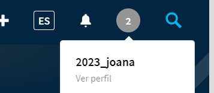
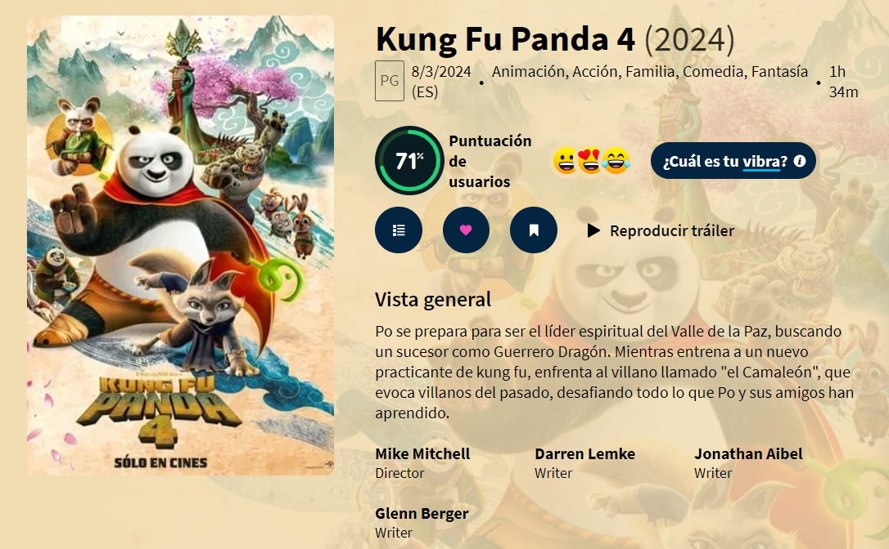

# UF4 The Movie Data Base + postman
## Objectiu
Mitjançant la plataforma The Movie Database invocarem a la seva API per a que ens permeti afegir
pel·lícules a preferits, crear llistes, visualitzar-les...

## Primers passos. Claus. Api key, request code i session id
Registrar-se a: [https://www.themoviedb.org/](https://www.themoviedb.org/) 

Generar session id: [https://developers.themoviedb.org/3/authentication/how-do-i-generate-a-session-
id/](https://developers.themoviedb.org/3/authentication/how-do-i-generate-a-session-id)

Desde postman fer GET (guardar-se el response): 
```
    https://api.themoviedb.org/3/authentication/token/new?api_key=AQUI_EL_TOKEN_GENERAT
```

Crear token : [https://developers.themoviedb.org/3/authentication/create-request-token](https://developers.themoviedb.org/3/authentication/create-request-token)

Desde postman POST i pasar-li body(ens retornarà la session_id): 
```
    https://api.themoviedb.org/3/authentication/session/new?api_key=AQUI_EL_TOKEN_GENERAT
```
Response:
```
    {
        "request_token": "AQUI EL REQUEST TOKEN QUE VA RETORNAR L'ANTERIOR GET"
    }
```

Si tot això ha funcionat correctament hauríem de poder veure la sessió creada a l’apartat Sessions API

Account id que utilitzo: 

## Exercicis postman
1. Des de la web afegeix una pel·lícula a preferits


2. Mitjançant el postman llista totes les pel·lícules preferides

```
    https://api.themoviedb.org/3/account/{account_id}/favorite/movies
``` 