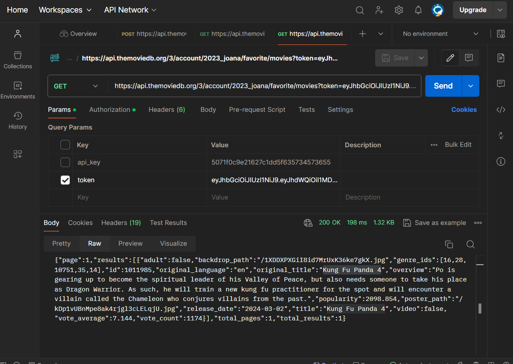
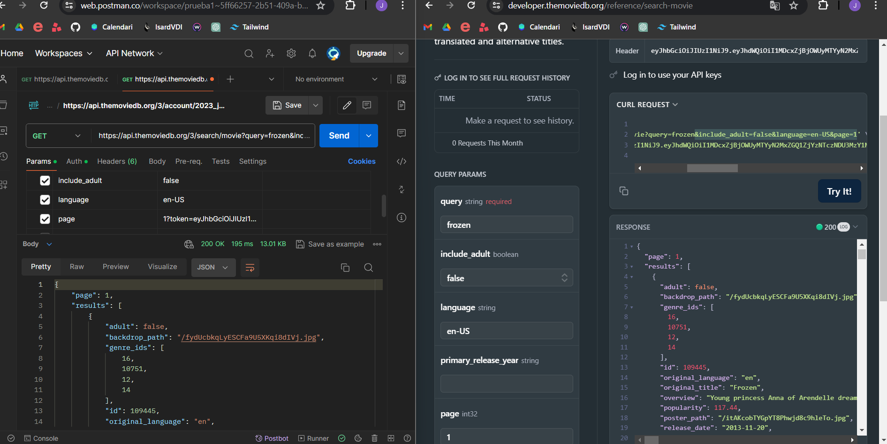
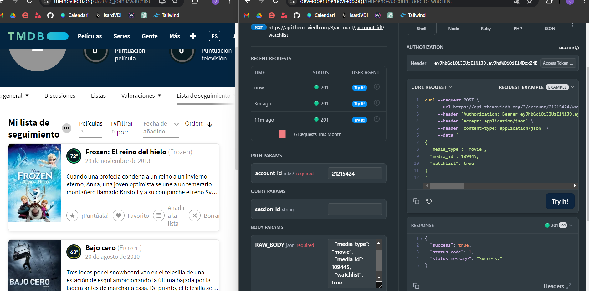
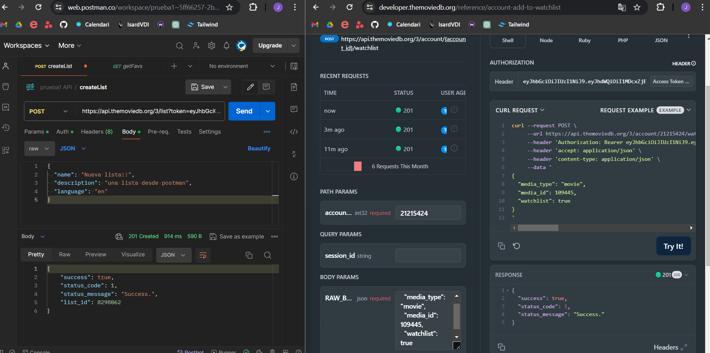
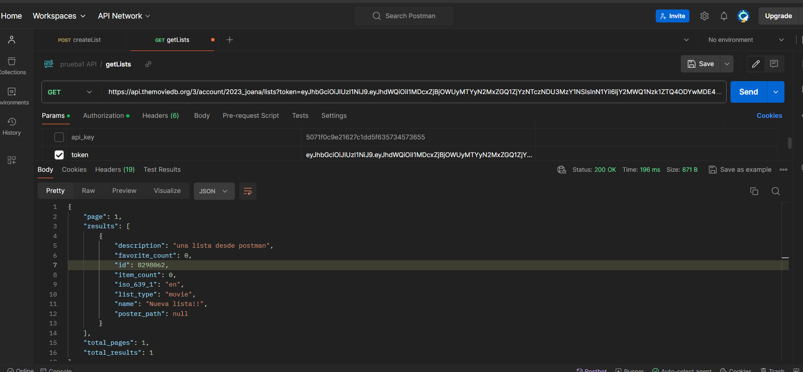
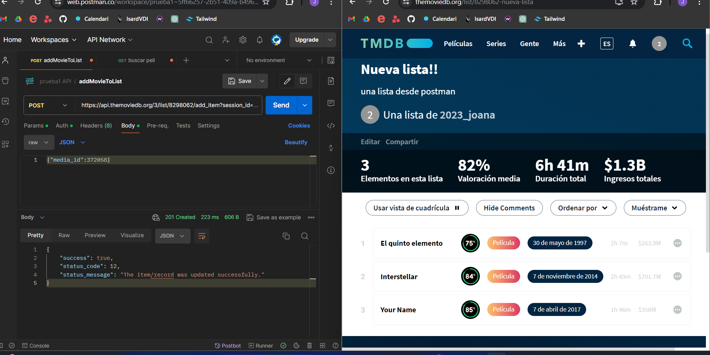

# UF4 The Movie Data Base + postman
## Objectiu
Mitjançant la plataforma The Movie Database invocarem a la seva API per a que ens permeti afegir
pel·lícules a preferits, crear llistes, visualitzar-les...

## Primers passos. Claus. Api key, request code i session id
Registrar-se a: [https://www.themoviedb.org/](https://www.themoviedb.org/) 

Generar session id: [https://developers.themoviedb.org/3/authentication/how-do-i-generate-a-session-
id/](https://developers.themoviedb.org/3/authentication/how-do-i-generate-a-session-id)

Desde postman fer GET (guardar-se el response): 
```
    https://api.themoviedb.org/3/authentication/token/new?api_key=AQUI_EL_TOKEN_GENERAT
```

Crear token : [https://developers.themoviedb.org/3/authentication/create-request-token](https://developers.themoviedb.org/3/authentication/create-request-token)

Desde postman POST i pasar-li body(ens retornarà la session_id): 
```
    https://api.themoviedb.org/3/authentication/session/new?api_key=AQUI_EL_TOKEN_GENERAT
```
Response:
```
    {
        "request_token": "AQUI EL REQUEST TOKEN QUE VA RETORNAR L'ANTERIOR GET"
    }
```

Si tot això ha funcionat correctament hauríem de poder veure la sessió creada a l’apartat Sessions API

Account id que utilitzo:

 

Account id int32: **21215424**

Exemple de session id: **e0d31ad1cbaaecfc92314bf630cc80a419974560**

## Exercicis postman
1. Des de la web afegeix una pel·lícula a preferits


2. Mitjançant el postman llista totes les pel·lícules preferides

    ```
        https://api.themoviedb.org/3/account/{account_id}/favorite/movies
    ``` 
    

3. Mitjançant el postman fes una cerca d’alguna pel·lícula que t’agradi

    ```
        https://developers.themoviedb.org/3/search/search-movies
    ```
    *Segurament et sortirà més d’un resultat. Copia l’id d’alguna d’aquestes pel·lícules per al següent exercici
    

4. Afegeix la pel·lícula a watchlist
    ```
        https://developers.themoviedb.org/3/account/add-to-watchlist
    ```
    *A través del teu espai personal comprova que la pel·lícula s’hagi afegit correctament.
    

5. Crea una nova llista
    ```
        https://developers.themoviedb.org/3/lists/create-list
    ```
    *A través del teu espai personal comprova que la llista s’hagi afegit correctament.
    

6. Mostra les llistes creades
    ```
        https://developers.themoviedb.org/3/account/get-created-lists
    ```
    *Guarda’t l’ID de la llista creada pel següent exercici
    

7. Afegeix una pel·lícula a la llista
    ```
        https://developers.themoviedb.org/3/lists/add-movie
    ```
    